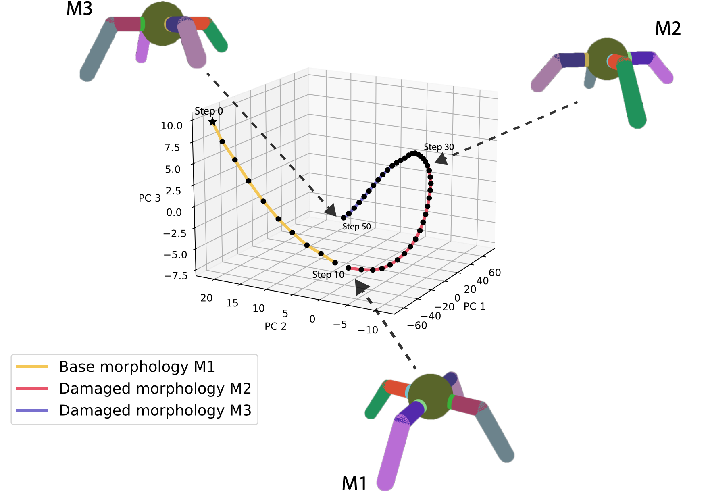

 
---

<div align="center">    
 
# HyperNCA: Growing Developmental Networks with Neural Cellular Automata

[](https://arxiv.org/abs/2204.11674)

</div>
 
This reposistory contains the code to grow networks using our HyperNCA metamorphosis networks as described in our paper [HyperNCA: Growing Developmental Networks  with Neural Cellular Automata, 2022](https://arxiv.org/abs/2204.11674).

<!-- 
<p align="center">
  
</p> -->



## How to run 
<!--  -->
First, install dependencies. Use `Python >= 3.9`:
```bash
# clone project   
git clone https://github.com/enajx/HyperNCA   

# install dependencies   
cd HyperNCA 
git checkout metamorphosis
pip install -r requirements.txt
 ```   
 Next, use `train_NCA.py` to train an agent. You can train any state-vector based OpenAI Gym's or pyBullet environments:

The different quadruped morphologies can be found in the folder *bullet ants*. In order to 
reproduce the damaged quadruped results, these new morphologies need to be firstly [registered as custom environments](https://github.com/openai/gym/wiki/Environments). The modified files are all included in the folder.


 ```bash
# train HyperNCA to solve three ants morphologies (need to register new ant morphologies first):
# In its current implemntation, the code only allows to train morphing between environments with observation-action spaces of the same size but this could easily be changed.

python train_NCA_metamorphosis.py

```

 Use `python train_NCA_metamorphosis.py --help` to display all the training options:


 ```

train_NCA_metamorphosis.py [-h] [--environment  [...]] [--generations] [--popsize] [--print_every] [--x0_dist] [--sigma_init] [--threads] [--seed_type] [--NCA_dimension] [--size_substrate] [--NCA_channels] [--reading_channel] [--update_net_channel_dims] [--living_threshold] [--policy_layers] [--NCA_MLP | --no-NCA_MLP] [--NCA_bias] [--NCA_MLP_nb_layers] [--NCA_MLP_hidden]
[--neighborhood] [--save_model | --no-save_model] [--random_seed | --no-random_seed]
[--random_seed_env | --no-random_seed_env] [--penalty_off_topology | --no-penalty_off_topology]
[--co_evolve_seed | --no-co_evolve_seed] [--plastic | --no-plastic] [--NCA_steps] [--metamorphosis_NCA_steps]
[--replace | --no-replace] [--normalise | --no-normalise] [--reward_type]

arguments:
  
  --environment         Environments: any set state-vector OpenAI Gym or pyBullet environment may be used, they all need to have the same observation-action
                        space sizes.
  --generations         Number of generations that the ES will run.
  --popsize             Population size.
  --print_every         Print every N steps.
  --x0_dist             Distribution used to sample intial value for CMA-ES
  --sigma_init          Initial sigma: modulates the amount of noise used to populate each new generation.
  --threads             Number of threads used to run evolution in parallel: -1 uses all physical cores available.
  --seed_type           Seed type: activations, single_seed, ones, randomU2 [-1,1]
  --NCA_dimension       NCA dimension 2 or 3: 2 uses 2D seeds (one per layer) and 2DConv, 3 uses a single 3D seed and 3DConvs
  --size_substrate      Size of every fc layer (3D). If 0, it takes the smallest size needed
  --NCA_channels        NCA channels
  --reading_channel     Seed channel from which the pattern will be taken to become the NN weigths.
  --NCA_bias            Whether the NCA has bias
                        If called, it will not save the resulting model (default: True)
  --random_seed, --no-random_seed
                        If true and seed is type random, the NCA uses a random seed at each episode (default: False)
  --random_seed_env, --no-random_seed_env
                        If true is uses a random seed to run the gym environments at each episode (default: False)
  --NCA_steps           Number of initial NCA steps
  --metamorphosis_NCA_steps
                        Number of NCA steps between envs (metamorphose)
  --replace, --no-replace
                        If true, NCA values are replaced by new values, not added (default: False)
  --normalise, --no-normalise
                        Normalise NCA output (default: True)
  --reward_type         Reaward type for the sequence of morphologies: min, sum, mean, std


```

Once trained, use `fitness_functions.py --id <run_id>` to test the grown network, eg, to evaluate the reported metamorphosis for the quadrupeds:
 ```

python fitness_functions.py --id 1644785913
 ```

If you want to train the model, you can find the specific parameters on use to train the models o each of the model configuration `.yml` files in `saved_models`. 


## Citation   

If you use the code for academic or commecial use, please cite the associated paper:

```bibtex

@inproceedings{najarro2022hypernca,
  title={HyperNCA: Growing Developmental Networks with Neural Cellular Automata},
  author={Najarro, Elias and Sudhakaran, Shyam and Glanois, Claire and Risi, Sebastian},
  doi = {10.48550/ARXIV.2204.11674},
  url = {https://arxiv.org/abs/2204.11674},
  booktitle={From Cells to Societies: Collective Learning across Scales},
  year={2022}
}


```   