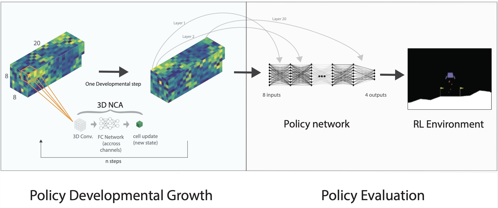

 
---

<div align="center">    
 
# HyperNCA: Growing Developmental Networks with Neural Cellular Automata

[](https://arxiv.org/abs/2204.11674)

</div>
 
This reposistory contains the code to grow networks using our HyperNCA method on any [Gym environment](https://github.com/openai/gym/wiki/Table-of-environments) or [pyBullet environment](https://github.com/bulletphysics/bullet3) as described in our paper [HyperNCA: Growing Developmental Networks  with Neural Cellular Automata, 2022](https://arxiv.org/abs/2204.11674).
Additionally, you can train any custom environment by [registering them.](https://github.com/openai/gym/wiki/Environments)
<!-- 
<p align="center">
  
</p> -->



## How to run   
<!--  -->
First, install dependencies. Use `Python >= 3.9`:
```bash
# clone project   
git clone https://github.com/enajx/HyperNCA   

# install dependencies   
cd HyperNCA 
pip install -r requirements.txt
 ```   
 Next, use `train_NCA.py` to train an agent. You can train any state-vector based OpenAI Gym's or pyBullet environments:
 
 ```bash
# train HyperNCA to solve the Lunar Lander:
python train_NCA.py --environment LunarLander-v2

```

 Use `python train_NCA.py --help` to display all the training options:


 ```

train_NCA.py [-h] [--environment  [...]] [--generations] [--popsize] [--print_every] [--x0_dist] 
    [--sigma_init] [--threads] [--seed_type] [--NCA_steps] [--NCA_dimension] [--size_substrate]
    [--NCA_channels] [--reading_channel] [--update_net_channel_dims] [--living_threshold] [--policy_layers]
    [--NCA_bias] [--neighborhood] [--save_model | --no-save_model] [--random_seed | --no-random_seed] 
    [--random_seed_env | --no-random_seed_env] [--normalise | --no-normalise] [--replace | --no-replace] 
    [--co_evolve_seed | --no-co_evolve_seed] [--plastic | --no-plastic]

arguments:
  
  --environment         Environment: any state-vector OpenAI Gym or pyBullet environment may be used
  --generations         Number of generations that the ES will run.
  --popsize             Population size.
  --print_every         Print every N steps.
  --x0_dist             Distribution used to sample intial value for CMA-ES
  --sigma_init          Initial sigma: modulates the amount of noise used to populate each new generation. 
  --threads             Number of threads used to run evolution in parallel: -1 uses all physical cores available.
  --seed_type           Seed type: single_seed, randomU2: [-1,1]
  --NCA_steps           NCA steps
  --NCA_dimension       NCA dimension: 3 uses a single 3D seed and 3DConvs
  --size_substrate      Size of every fc layer (3D). For 3D: if 0, it takes the smallest size needed.
  --NCA_channels        NCA channels
  --reading_channel     Seed channel from which the pattern will be taken to become the NN weigths.
  --NCA_bias            Whether the NCA has bias
  --random_seed         If true and seed is type random, the NCA uses a random seed at each episode (default: False)
  --random_seed_env     If true is uses a random seed to run the gym environments at each episode (default: True)
  --normalise           Normalise NCA output (default: True)


```

Once trained, use `fitness_functions.py --id <run_id>` to test the grown network, eg, to evaluate the reported model in the paper for the Lunar Lander:
 ```python

python fitness_functions.py --id 1645360631

```

When running on a headless server some environments will require a virtual display to run -eg. CarRacing-v0-, in this case run:
 ```bash

xvfb-run -a -s "-screen 0 1400x900x24 +extension RANDR" -- python train_NCA.py --environment LunarLander-v2

```


## Reproduce the paper's results and evaluate the reported models in the paper

Use `python fitness_functions.py --id <run_id>` to evaluate reported models:


| Id            | Enviroment    | Substrate |
| ------------- |:-------------:| ------:|
| 1645447353    | Lander        | Random 5 layers |
| 1646940683    | Lander        | Single 4 layers |
| 1647084085    | Quadruped     | Single 4 layers |
| 1645360631    | Quadruped     | Random 3 layers |
| 1645605120    | Quadruped     | Random 30 layers |


If you want to train the model, you can find the specific parameters on use to train the models o each of the model configuration `.yml` files in `saved_models`. 


## Methamorphosis neural networks

To code to train the *Methamorphosis neural networks*, can be found in the *metamorphosis* branch of this repository. The NCA implementations are identical to the one used in this branch, the only code difference is the logic flow to make use of the morphing weights into the RL agent. The id of the reported metamorphosis model is 1644785913 and be evaluated in the metamorphosis branch with `python fitness_functions.py --id 1644785913`


The different quadruped morphologies can be found in the folder *bullet ants*. In order to 
reproduce the damaged quadruped results, these new morphologies need to be firstly [registered as custom environments](https://github.com/openai/gym/wiki/Environments). The modified files are all included in the folder.


## Citation   

If you use the code for academic or commecial use, please cite the associated paper:

```bibtex

@inproceedings{najarro2022hypernca,
  title={HyperNCA: Growing Developmental Networks with Neural Cellular Automata},
  author={Najarro, Elias and Sudhakaran, Shyam and Glanois, Claire and Risi, Sebastian},
  doi = {10.48550/ARXIV.2204.11674},
  url = {https://arxiv.org/abs/2204.11674},
  booktitle={From Cells to Societies: Collective Learning across Scales},
  year={2022}
}

```   